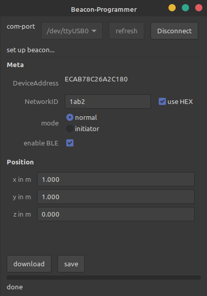
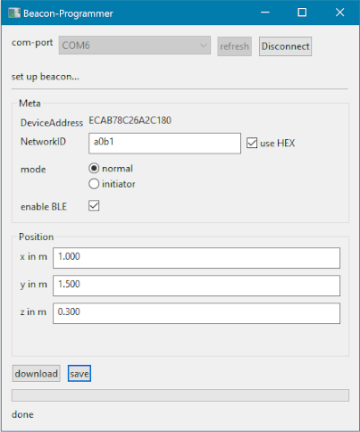

# dwm1001 setup tool

dwm1001 anchor setup tool using the uart interface.

should be running on every OS, tested for:
* Ubuntu(18) x64
* Win10 x64

## how to use it

* download the binaries and open the gui.
  * https://github.com/juri117/go-dwm1001-setup-tool/releases
* connect a dwm1001 using a serial to usb converter
* select com port, click *connect*
* wait until all values are showing
* enter the desired parameter
* press *save*: this stores the settings persistent




## settings

| name       | type               | usage                                                                                                   |
| :--------- | :----------------- | :------------------------------------------------------------------------------------------------------ |
| mode       | normal / initiator | each network needs to have one beacon that acts as initiatror                                           |
| enable BLE       | yes / no | enable/disable onboard BLE, wont use much more power but opens potential security breach                                   |
| network id | 4 digit hex. <br>(or dec.)        | can be changed if more networks should coexist but has to be the same on all devices within one network |
| x          | float              | x position of the beacon in meters                                                                                     |
| y          | float              | y position of the beacon in meters                                                                                     |
| z          | float              | z (up) position of the beacon in meters                                                                                |

The position should be manually measured as accurate as possible (centimeter accuracy is fine).

## dwm1001 LED indicator

| green      | red        | description                                |
| :--------- | :--------- | :----------------------------------------- |
| blink fast | blink fast | Anchor: no UWB signal for more than 8 sec. |
| blink slow | blink slow | Tag: no UWB signal for more than 8 sec.    |
| on         |            | connected anchor or tag                    |
| blink slow |            | connected anchor initiator                 |
| blink fast |            | communication detected                     |
| on         | on         | passive or off mode                        |


## build

### windows

```
go build -ldflags -H=windowsgui dwm1001-setup-tool.go uart_receiver.go
```
the flag hide the cmd window

### Ubuntu

```
go build dwm1001-setup-tool.go uart_receiver.go
```
